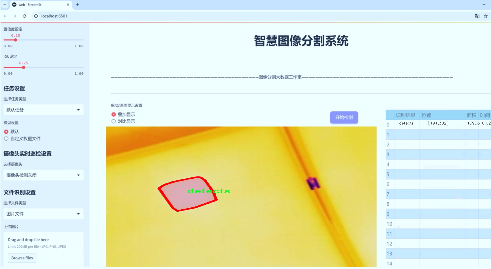
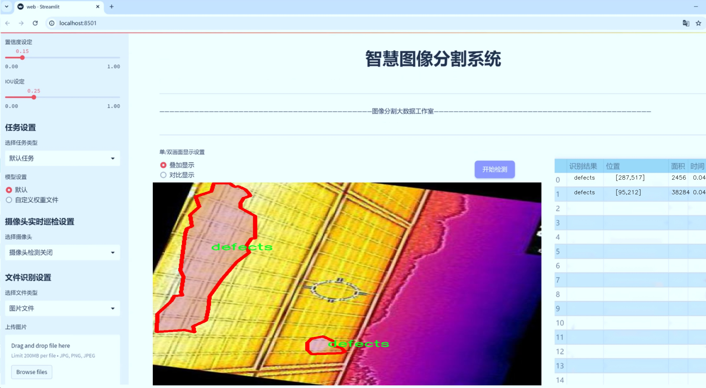
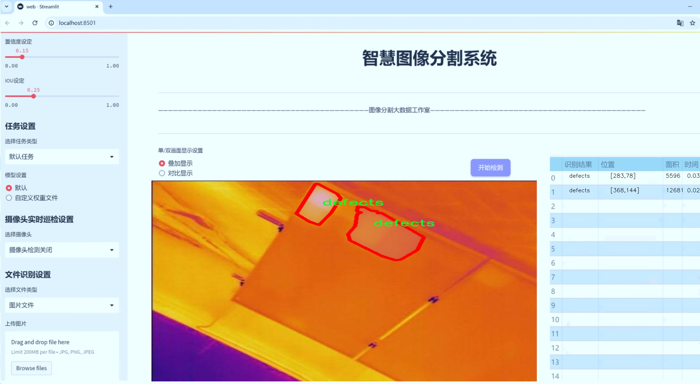
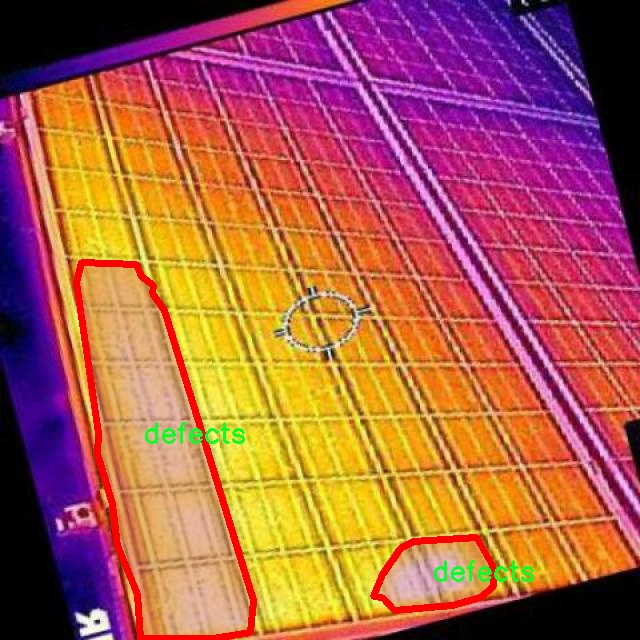
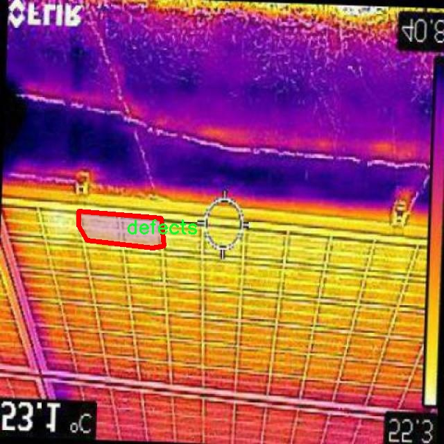
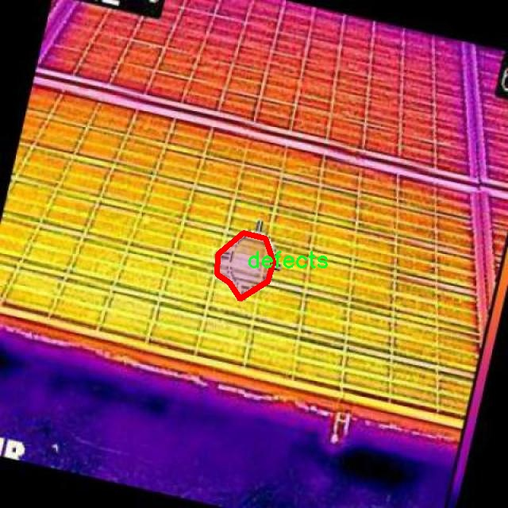
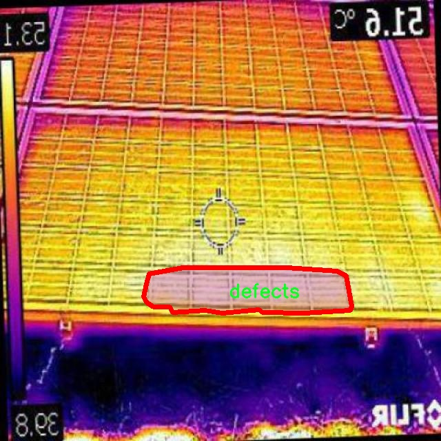

# 太阳能板缺陷分割系统： yolov8-seg-dyhead

### 1.研究背景与意义

[参考博客](https://gitee.com/YOLOv8_YOLOv11_Segmentation_Studio/projects)

[博客来源](https://kdocs.cn/l/cszuIiCKVNis)

研究背景与意义

随着全球对可再生能源的日益重视，太阳能作为一种清洁、可再生的能源形式，正在快速发展。太阳能光伏系统的广泛应用使得其维护和管理变得尤为重要。光伏组件在长期使用过程中，可能会出现各种缺陷，如旁路二极管短路、分层、模块开路和整个模块短路等。这些缺陷不仅影响光伏组件的发电效率，还可能导致系统的整体故障，进而造成经济损失。因此，及时、准确地检测和分割太阳能板的缺陷，对于提高光伏系统的可靠性和效率具有重要意义。

近年来，深度学习技术在计算机视觉领域取得了显著进展，尤其是在目标检测和图像分割任务中。YOLO（You Only Look Once）系列模型因其高效的实时检测能力而受到广泛关注。YOLOv8作为该系列的最新版本，结合了更为先进的特征提取和处理机制，展现出优越的性能。然而，传统的YOLOv8模型在处理复杂的光伏组件缺陷时，仍然面临一些挑战，例如对小目标的检测能力不足、背景干扰的影响以及对多类别缺陷的分割精度不高等。因此，基于改进YOLOv8的太阳能板缺陷分割系统的研究，旨在提升缺陷检测的准确性和鲁棒性。

本研究将采用一个包含1200张图像的专用数据集，该数据集涵盖了五类缺陷，包括旁路二极管短路、分层、模块开路、整个模块短路等。这些类别的多样性为模型的训练和评估提供了丰富的样本，能够有效提升模型对不同缺陷的识别能力。通过对数据集的深入分析和预处理，结合改进的YOLOv8模型，研究将探索如何在复杂背景下实现高效的缺陷分割。

此外，缺陷检测的自动化和智能化不仅可以减少人工检查的成本和时间，还能提高检测的准确性，降低漏检和误检的风险。这对于光伏产业的可持续发展具有重要的现实意义。通过建立一个高效的缺陷分割系统，能够为光伏组件的运维提供科学依据，帮助企业及时发现和处理潜在问题，从而延长组件的使用寿命，提高发电效率。

综上所述，基于改进YOLOv8的太阳能板缺陷分割系统的研究，不仅具有重要的学术价值，还能为光伏产业的实际应用提供切实可行的解决方案。通过深入探索深度学习技术在光伏组件缺陷检测中的应用，推动相关技术的发展，助力可再生能源的广泛应用和普及，具有深远的社会和经济意义。

### 2.图片演示







注意：本项目提供完整的训练源码数据集和训练教程,由于此博客编辑较早,暂不提供权重文件（best.pt）,需要按照6.训练教程进行训练后实现上图效果。

### 3.视频演示

[3.1 视频演示](https://www.bilibili.com/video/BV11UzRYKEuJ/)

### 4.数据集信息

##### 4.1 数据集类别数＆类别名

nc: 1
names: ['defects']


##### 4.2 数据集信息简介

数据集信息展示

在现代可再生能源领域，太阳能作为一种清洁且可持续的能源来源，正受到越来越多的关注。随着太阳能板的广泛应用，确保其质量和性能的关键在于及时发现和修复缺陷。因此，针对太阳能板缺陷的自动检测与分割技术显得尤为重要。本研究所使用的数据集“Solarpane defect detections”专门为改进YOLOv8-seg的太阳能板缺陷分割系统而构建，旨在提高缺陷检测的准确性和效率。

该数据集的设计考虑到了实际应用中的多样性和复杂性，包含了多种类型的太阳能板缺陷，虽然在类别数量上相对简单，仅设定为一个类别——“defects”，但其内部的多样性和复杂性为模型的训练提供了丰富的样本。这一类别涵盖了所有可能影响太阳能板性能的缺陷，如裂纹、污垢、腐蚀、焊接不良等，确保了模型能够学习到不同缺陷的特征和表现形式。

数据集的构建过程经过精心设计，首先通过高分辨率的图像采集技术，确保每一张图像都能清晰地展示太阳能板的表面状态。随后，数据标注团队对收集到的图像进行了细致的标注，确保每个缺陷都被准确地识别和标记。这一过程不仅提升了数据集的质量，也为后续的模型训练提供了坚实的基础。

在数据集的规模方面，虽然具体的样本数量未在此处列出，但为了确保模型的泛化能力和鲁棒性，数据集应包含足够多的样本，以覆盖不同的光照条件、角度和背景。这种多样性使得模型在面对真实世界中的复杂情况时，能够更好地适应和应对。

在数据预处理阶段，数据集还经过了一系列的增强处理，如旋转、缩放、翻转等，以增加样本的多样性和丰富性。这些处理不仅有助于提高模型的训练效果，还能有效防止过拟合现象的发生，确保模型在未见样本上的表现依然优异。

通过使用“Solarpane defect detections”数据集，改进后的YOLOv8-seg模型能够在检测和分割太阳能板缺陷方面实现更高的准确率和效率。这一研究不仅为太阳能板的维护和管理提供了有效的技术支持，也为相关领域的研究提供了宝贵的数据基础。随着数据集的不断完善和模型的不断优化，未来在太阳能板缺陷检测的自动化和智能化方面，将会有更大的突破和进展。










### 5.项目依赖环境部署教程（零基础手把手教学）

[5.1 环境部署教程链接（零基础手把手教学）](https://www.bilibili.com/video/BV1jG4Ve4E9t/?vd_source=bc9aec86d164b67a7004b996143742dc)


[5.2 安装Python虚拟环境创建和依赖库安装视频教程链接（零基础手把手教学）](https://www.bilibili.com/video/BV1nA4VeYEze/?vd_source=bc9aec86d164b67a7004b996143742dc)

### 6.手把手YOLOV8-seg训练视频教程（零基础手把手教学）

[6.1 手把手YOLOV8-seg训练视频教程（零基础小白有手就能学会）](https://www.bilibili.com/video/BV1cA4VeYETe/?vd_source=bc9aec86d164b67a7004b996143742dc)


按照上面的训练视频教程链接加载项目提供的数据集，运行train.py即可开始训练



     Epoch   gpu_mem       box       obj       cls    labels  img_size
     1/200     0G   0.01576   0.01955  0.007536        22      1280: 100%|██████████| 849/849 [14:42<00:00,  1.04s/it]
               Class     Images     Labels          P          R     mAP@.5 mAP@.5:.95: 100%|██████████| 213/213 [01:14<00:00,  2.87it/s]
                 all       3395      17314      0.994      0.957      0.0957      0.0843

     Epoch   gpu_mem       box       obj       cls    labels  img_size
     2/200     0G   0.01578   0.01923  0.007006        22      1280: 100%|██████████| 849/849 [14:44<00:00,  1.04s/it]
               Class     Images     Labels          P          R     mAP@.5 mAP@.5:.95: 100%|██████████| 213/213 [01:12<00:00,  2.95it/s]
                 all       3395      17314      0.996      0.956      0.0957      0.0845

     Epoch   gpu_mem       box       obj       cls    labels  img_size
     3/200     0G   0.01561    0.0191  0.006895        27      1280: 100%|██████████| 849/849 [10:56<00:00,  1.29it/s]
               Class     Images     Labels          P          R     mAP@.5 mAP@.5:.95: 100%|███████   | 187/213 [00:52<00:00,  4.04it/s]
                 all       3395      17314      0.996      0.957      0.0957      0.0845


### 7.50+种全套YOLOV8-seg创新点加载调参实验视频教程（一键加载写好的改进模型的配置文件）

[7.1 50+种全套YOLOV8-seg创新点加载调参实验视频教程（一键加载写好的改进模型的配置文件）](https://www.bilibili.com/video/BV1Hw4VePEXv/?vd_source=bc9aec86d164b67a7004b996143742dc)

### YOLOV8-seg算法简介

原始YOLOv8-seg算法原理

YOLOv8-seg算法是YOLO系列中的最新版本，专注于目标检测与分割任务，展现了更高的性能和灵活性。该算法的设计基于深度学习的前沿技术，旨在实现快速、准确的目标识别与分割。YOLOv8-seg的核心架构由三个主要部分组成：Backbone、Neck和Head，每个部分都在算法的整体性能中扮演着至关重要的角色。

在Backbone部分，YOLOv8-seg采用了CSPDarknet结构，这是一种先进的特征提取网络。CSPDarknet通过将网络分为两个部分，并在每个部分中引入多个残差块，显著提高了特征提取的效率和准确性。与前代YOLOv5相比，YOLOv8-seg引入了C2f模块，替代了传统的C3模块。C2f模块的设计使得输入特征图被分为两个分支，每个分支经过卷积层进行降维处理，这种结构的引入不仅提高了特征图的维度，也为后续的特征融合提供了更丰富的信息流。此外，YOLOv8-seg还采用了v8_C2fBottleneck层，进一步增强了特征提取的能力。这些分支的堆叠形成了更高维度的特征图，并通过卷积层进行融合，确保了梯度流的有效传递。

Neck部分则负责多尺度特征的融合。YOLOv8-seg利用特征金字塔网络（FPN）和路径聚合网络（PAN）结构，将来自Backbone不同阶段的特征图进行有效融合。这种融合技术能够更好地捕捉不同尺度目标的信息，从而提升了目标检测的性能和鲁棒性。通过这种方式，YOLOv8-seg能够在处理复杂场景时，保持对小目标和大目标的高效检测能力。

在Head部分，YOLOv8-seg的设计更加注重最终的目标检测和分类任务。该部分设有多个检测头，能够在不同尺寸的信息下进行目标检测。每个检测头都包含一系列卷积层和反卷积层，负责将融合后的特征图转换为最终的检测结果。YOLOv8-seg采用无锚框（Anchor-Free）的检测方式，直接预测目标的中心点和宽高比例。这种方法的优势在于减少了Anchor框的数量，从而提高了检测速度和准确度，使得模型在实际应用中更加高效。

此外，YOLOv8-seg还引入了快速空间金字塔池化（SPPF）结构，旨在提取不同尺度的特征。这一结构的设计有效减少了模型的参数量和计算量，同时提升了特征提取的效率，使得YOLOv8-seg在面对高分辨率图像时，依然能够保持良好的性能。通过这些创新，YOLOv8-seg不仅在速度上有了显著提升，同时在准确性和鲁棒性方面也表现出色。

YOLOv8-seg的训练和部署框架基于Pytorch，极大地方便了自定义模型的训练。这一框架的引入，使得研究人员和开发者能够更灵活地调整模型结构和参数，从而适应不同的应用场景。YOLOv8-seg的多样化网络结构，包括YOLOv8n、YOLOv8s、YOLOv8m、YOLOv8l和YOLOv8x，提供了不同的Backbone和残差块配置，以满足不同规模和复杂度的任务需求。

总的来说，YOLOv8-seg算法通过引入先进的网络结构和高效的特征提取技术，显著提升了目标检测与分割的性能。其无锚框的检测方式、强大的特征融合能力以及灵活的训练框架，使得YOLOv8-seg在计算机视觉领域中，尤其是在实时目标检测和分割任务中，展现出极大的潜力和应用价值。随着YOLOv8-seg的不断发展和优化，未来在智能监控、自动驾驶、医疗影像分析等领域的应用前景将更加广阔。


### 9.系统功能展示（检测对象为举例，实际内容以本项目数据集为准）

图9.1.系统支持检测结果表格显示

  图9.2.系统支持置信度和IOU阈值手动调节

  图9.3.系统支持自定义加载权重文件best.pt(需要你通过步骤5中训练获得)

  图9.4.系统支持摄像头实时识别

  图9.5.系统支持图片识别

  图9.6.系统支持视频识别

  图9.7.系统支持识别结果文件自动保存

  图9.8.系统支持Excel导出检测结果数据


### 10.50+种全套YOLOV8-seg创新点原理讲解（非科班也可以轻松写刊发刊，V11版本正在科研待更新）

#### 10.1 由于篇幅限制，每个创新点的具体原理讲解就不一一展开，具体见下列网址中的创新点对应子项目的技术原理博客网址【Blog】：


[10.1 50+种全套YOLOV8-seg创新点原理讲解链接](https://gitee.com/qunmasj/good)

#### 10.2 部分改进模块原理讲解(完整的改进原理见上图和技术博客链接)【如果此小节的图加载失败可以通过CSDN或者Github搜索该博客的标题访问原始博客，原始博客图片显示正常】

### YOLOv8简介
继YOLOv5之后,Ultralytics公司在2023年1月发布了YOLOv8,该版本可以用于执行目标检测、实例分割和图像分类任务。整个网络结构由4部分组成:输入图像, Backbone主干网络获得图像的特征图, Head检测头预测目标对象和位置, Neck融合不同层的特征并将图像特征传递到预测层。
1)相比于YOLOv5和 YOLOv7算法,YOLOv8在训练时间和检测精度上得到极大提升,而且模型的权重文件只有6 MB,可以部署到任一嵌入式设备中,它凭借自身快速、高效的性能可以很好地满足实时检测的需求。
2)由于YOLOv8算法是YOLOv5的继承版本，对应提供了N、S、 M、L、X 等不同尺度的模型,用于满足不同场景的需求,在精度得到大幅提升的同时,能流畅地训练,并且能安装在各种硬件平台上运行。
3)在输入端,YOLOv8算法使用了Mosaic数据增强[15]、自适应锚框计算[16]等方法。Mosaic数据增强是通过随机缩放、随机裁剪、随机排布的方式进行拼接,丰富检测数据集。自适应锚框计算是网络在初始锚框的基础上输出预测框,通过差值计算、反向更新等操作计算出最佳锚框值。
4)在输出端,YOLOv8算法使用解耦头替换了以往的耦合头,将分类和回归解耦为两个独立的分支,通过解耦使各个任务更加专注,从而解决复杂场景下定位不准及分类错误的问题。


### OREPA：在线卷积重参数化
卷积神经网络(CNNs)已经在许多计算机视觉任务的应用成功，包括图像分类、目标检测、语义分割等。精度和模型效率之间的权衡也已被广泛讨论。

一般来说，一个精度较高的模型通常需要一个更复杂的块，一个更宽或更深的结构。然而，这样的模型总是太重，无法部署，特别是在硬件性能有限、需要实时推理的场景下。考虑到效率，更小、更紧凑和更快的模型自然是首选。

为了获得一个部署友好且高精度的模型，有研究者提出了基于结构重参数化的方法来释放性能。在这些方法中，模型在训练阶段和推理阶段有不同的结构。具体来说，使用复杂的训练阶段拓扑，即重参数化的块，来提高性能。训练结束后，通过等效变换将一个复杂的块重参为成一个单一的线性层。重参后的模型通常具有一个整洁架构模型，例如，通常是一个类似VGG的或一个类似ResNet的结构。从这个角度来看，重参化策略可以在不引入额外的推理时间成本的情况下提高模型的性能。


BN层是重构模型的关键组成部分。在一个重新解析块(图1(b))中，在每个卷积层之后立即添加一个BN层。可以观察到，去除这些BN层会导致的性能退化。然而，当考虑到效率时，这种BN层的使用出乎意料地在训练阶段带来了巨大的计算开销。在推理阶段，复杂的块可以被压缩成一个卷积层。但是，在训练过程中，BN层是非线性的，也就是说，它们将特征映射除以它的标准差，这就阻止了合并整个块。因此，存在大量的中间计算操作(large FLOPS)和缓冲特征映射(high memory usage)。更糟糕的是，这么高的训练预算使得很难探索更复杂和可能更强的重参块。很自然地，下面的问题就出现了：

为什么标准化在重参中这么重要？

通过分析和实验，作者认为BN层中的尺度因子最重要，因为它们能够使不同分支的优化方向多样化。

基于观察结果，作者提出了在线重参化(OREPA)(图1(c))，这是一个两阶段的pipeline，使之能够简化复杂的training-time re-param block。

在第一阶段，block linearization，去除所有的非线性BN层，并引入线性缩放层。这些层与BN层具有相似的性质，因此它们使不同分支的优化多样化。此外，这些层都是线性的，可以在训练过程中合并成卷积层。

第二阶段，block squeezing，将复杂的线性块简化为单一的卷积层。OREPA通过减少由中间计算层引起的计算和存储开销，显著降低了训练成本，对性能只有非常小的影响。

此外，高效化使得探索更复杂的重参化拓扑成为可能。为了验证这一点，作者进一步提出了几个重参化的组件，以获得更好的性能。

在ImageNet分类任务上评估了所提出的OREPA。与最先进的修复模型相比，OREPA将额外的训练时间GPU内存成本降低了65%到75%，并将训练过程加快了1.5-2.3倍。同时，OREPA-ResNet和OREPA-VGG的性能始终优于+0.2%∼+0.6%之前的DBB和RepVGG方法。同时作者还评估了在下游任务上的OREPA，即目标检测和语义分割。作者发现OREPA可以在这些任务上也可以带来性能的提高。

提出了在线卷积重参化(OREPA)策略，这极大地提高了重参化模型的训练效率，并使探索更强的重参化块成为可能；

通过对重参化模型工作机制的分析，用引入的线性尺度层代替BN层，这仍然提供了不同的优化方向，并保持了表示能力;

在各种视觉任务上的实验表明，OREPA在准确性和训练效率方面都优于以前的重参化模型(DBB/RepVGG)。


#### 结构重参化
结构重参化最近被重视并应用于许多计算机视觉任务，如紧凑模型设计、架构搜索和剪枝。重参化意味着不同的架构可以通过参数的等价转换来相互转换。例如，1×1卷积的一个分支和3×3卷积的一个分支，可以转移到3×3卷积的单个分支中。在训练阶段，设计了多分支和多层拓扑来取代普通的线性层(如conv或全连接层)来增强模型。Cao等讨论了如何在训练过程中合并深度可分离卷积核。然后在推理过程中，将训练时间的复杂模型转移到简单模型中，以便于更快的推理。

在受益于复杂的training-time拓扑，同时，当前的重参化方法训练使用不可忽略的额外计算成本。当块变得更复杂以变得更强的表示时，GPU内存利用率和训练时间将会越来越长，最终走向不可接受。与以往的重参化方法不同，本文更多地关注训练成本。提出了一种通用的在线卷积重参化策略，使training-time的结构重参化成为可能。


#### Normalization
BN被提出来缓解训练非常深度神经网络时的梯度消失问题。人们认为BN层是非常重要的，因为它们平滑了损失。最近关于无BN神经网络的研究声称，BN层并不是不可或缺的。通过良好的初始化和适当的正则化，可以优雅地去除BN层。

对于重参化模型，作者认为重参化块中的BN层是关键的。无BN的变体将会出现性能下降。然而，BN层是非线性的，也就是说，它们将特征图除以它的标准差，这阻止了在线合并块。为了使在线重参化可行，作者去掉了重参块中的所有BN层，并引入了BN层的线性替代方法，即线性缩放层。

#### 卷积分解
标准卷积层计算比较密集，导致大的FLOPs和参数量。因此，卷积分解方法被提出，并广泛应用于移动设备的轻量化模型中。重参化方法也可以看作是卷积分解的某种形式，但它更倾向于更复杂的拓扑结构。本文的方法的不同之处在于，在kernel-level上分解卷积，而不是在structure level。

#### 在线重参化
在本节中，首先，分析了关键组件，即重参化模型中的BN层，在此基础上提出了在线重参化(OREPA)，旨在大大减少再参数化模型的训练时间预算。OREPA能够将复杂的训练时间块简化为一个卷积层，并保持了较高的精度。

OREPA的整体pipeline如图所示，它包括一个Block Linearization阶段和一个Block Squeezing阶段。


参考该博客通过分析多层和多分支结构的优化多样性，深入研究了重参化的有效性，并证明了所提出的线性缩放层和BN层具有相似的效果。

最后，随着训练预算的减少，进一步探索了更多的组件，以实现更强的重参化模型，成本略有增加。

#### 重参化中的Normalization
作者认为中间BN层是重参化过程中多层和多分支结构的关键组成部分。以SoTA模型DBB和RepVGG为例，去除这些层会导致严重的性能下降，如表1所示。


这种观察结果也得到了Ding等人的实验支持。因此，作者认为中间的BN层对于重参化模型的性能是必不可少的。

然而，中间BN层的使用带来了更高的训练预算。作者注意到，在推理阶段，重参化块中的所有中间操作都是线性的，因此可以合并成一个卷积层，从而形成一个简单的结构。

但在训练过程中，BN层是非线性的，即它们将特征映射除以其标准差。因此，中间操作应该单独计算，这将导致更高的计算和内存成本。更糟糕的是，如此高的成本将阻止探索更强大的训练模块。

#### Block Linearization
如3.1中所述，中间的BN层阻止了在训练过程中合并单独的层。然而，由于性能问题，直接删除它们并不简单。为了解决这一困境，作者引入了channel级线性尺度操作作为BN的线性替代方法。

缩放层包含一个可学习的向量，它在通道维度中缩放特征映射。线性缩放层具有与BN层相似的效果，它们都促进多分支向不同的方向进行优化，这是重参化时性能提高的关键。除了对性能的影响外，线性缩放层还可以在训练过程中进行合并，使在线重参化成为可能。


基于线性缩放层，作者修改了重参化块，如图所示。具体来说，块的线性化阶段由以下3个步骤组成：

首先，删除了所有的非线性层，即重参化块中的BN层

其次，为了保持优化的多样性，在每个分支的末尾添加了一个缩放层，这是BN的线性替代方法

最后，为了稳定训练过程，在所有分支的添加后添加一个BN层。

一旦完成线性化阶段，在重参化块中只存在线性层，这意味着可以在训练阶段合并块中的所有组件。

#### Block Squeezing
Block Squeezing步骤将计算和内存昂贵的中间特征映射上的操作转换为更经济的kernel上的操作。这意味着在计算和内存方面从减少到，其中、是特征图和卷积核的空间尺寸。

一般来说，无论线性重参化块是多么复杂，以下2个属性始终成立：

Block中的所有线性层，例如深度卷积、平均池化和所提出的线性缩放，都可以用带有相应参数的退化卷积层来表示;

Block可以由一系列并行分支表示，每个分支由一系列卷积层组成。

有了上述两个特性，如果可以将

多层（即顺序结构）

多分支（即并行结构）

简化为单一卷积，就可以压缩一个块。在下面的部分中，将展示如何简化顺序结构(图(a))和并行结构(图(b))。


### 11.项目核心源码讲解（再也不用担心看不懂代码逻辑）

#### 11.1 ultralytics\utils\instance.py

以下是对代码的核心部分进行的分析和详细中文注释：

```python
import numpy as np
from collections import abc
from itertools import repeat
from numbers import Number
from typing import List

# 定义一个用于将输入转换为元组的辅助函数
def _ntuple(n):
    """从PyTorch内部实现，解析输入为n元组格式。"""
    def parse(x):
        """解析边界框格式，支持XYWH和LTWH格式。"""
        return x if isinstance(x, abc.Iterable) else tuple(repeat(x, n))
    return parse

# 定义2元组和4元组的转换函数
to_2tuple = _ntuple(2)
to_4tuple = _ntuple(4)

# 定义边界框格式
_formats = ['xyxy', 'xywh', 'ltwh']

class Bboxes:
    """
    处理边界框的类，支持多种格式（'xyxy', 'xywh', 'ltwh'）。
    """

    def __init__(self, bboxes, format='xyxy') -> None:
        """初始化Bboxes类，接收边界框数据和格式。"""
        assert format in _formats, f'无效的边界框格式: {format}, 必须是 {_formats} 中的一种'
        bboxes = bboxes[None, :] if bboxes.ndim == 1 else bboxes  # 如果输入是一维数组，转换为二维数组
        assert bboxes.ndim == 2
        assert bboxes.shape[1] == 4  # 确保每个边界框有4个坐标
        self.bboxes = bboxes
        self.format = format

    def convert(self, format):
        """将边界框格式从一种类型转换为另一种。"""
        assert format in _formats, f'无效的边界框格式: {format}, 必须是 {_formats} 中的一种'
        if self.format == format:
            return  # 如果格式相同，不做任何操作
        # 根据当前格式和目标格式选择转换函数
        func = self._get_conversion_function(format)
        self.bboxes = func(self.bboxes)  # 执行转换
        self.format = format  # 更新格式

    def _get_conversion_function(self, format):
        """根据当前格式和目标格式返回相应的转换函数。"""
        if self.format == 'xyxy':
            return xyxy2xywh if format == 'xywh' else xyxy2ltwh
        elif self.format == 'xywh':
            return xywh2xyxy if format == 'xyxy' else xywh2ltwh
        else:
            return ltwh2xyxy if format == 'xyxy' else ltwh2xywh

    def areas(self):
        """返回每个边界框的面积。"""
        self.convert('xyxy')  # 转换为xyxy格式以计算面积
        return (self.bboxes[:, 2] - self.bboxes[:, 0]) * (self.bboxes[:, 3] - self.bboxes[:, 1])  # 计算面积

    def mul(self, scale):
        """
        根据给定的缩放因子缩放边界框坐标。
        Args:
            scale (tuple | list | int): 四个坐标的缩放因子。
        """
        if isinstance(scale, Number):
            scale = to_4tuple(scale)  # 如果是单个数字，转换为4元组
        assert isinstance(scale, (tuple, list)) and len(scale) == 4
        self.bboxes[:, 0] *= scale[0]  # 缩放左上角x坐标
        self.bboxes[:, 1] *= scale[1]  # 缩放左上角y坐标
        self.bboxes[:, 2] *= scale[2]  # 缩放右下角x坐标
        self.bboxes[:, 3] *= scale[3]  # 缩放右下角y坐标

    def add(self, offset):
        """
        根据给定的偏移量移动边界框坐标。
        Args:
            offset (tuple | list | int): 四个坐标的偏移量。
        """
        if isinstance(offset, Number):
            offset = to_4tuple(offset)  # 如果是单个数字，转换为4元组
        assert isinstance(offset, (tuple, list)) and len(offset) == 4
        self.bboxes[:, 0] += offset[0]  # 移动左上角x坐标
        self.bboxes[:, 1] += offset[1]  # 移动左上角y坐标
        self.bboxes[:, 2] += offset[2]  # 移动右下角x坐标
        self.bboxes[:, 3] += offset[3]  # 移动右下角y坐标

    def __len__(self):
        """返回边界框的数量。"""
        return len(self.bboxes)

    @classmethod
    def concatenate(cls, boxes_list: List['Bboxes'], axis=0) -> 'Bboxes':
        """
        将多个Bboxes对象连接成一个Bboxes对象。
        Args:
            boxes_list (List[Bboxes]): 要连接的Bboxes对象列表。
            axis (int, optional): 连接的轴，默认为0。
        Returns:
            Bboxes: 一个新的Bboxes对象，包含连接后的边界框。
        """
        assert isinstance(boxes_list, (list, tuple)) and all(isinstance(box, Bboxes) for box in boxes_list)
        if not boxes_list:
            return cls(np.empty(0))  # 如果列表为空，返回一个空的Bboxes对象
        return cls(np.concatenate([b.bboxes for b in boxes_list], axis=axis))  # 连接边界框

class Instances:
    """
    包含图像中检测到的对象的边界框、分段和关键点的容器。
    """

    def __init__(self, bboxes, segments=None, keypoints=None, bbox_format='xywh', normalized=True) -> None:
        """
        初始化Instances对象。
        Args:
            bboxes (ndarray): 边界框数组，形状为[N, 4]。
            segments (list | ndarray, optional): 对象分段，默认为None。
            keypoints (ndarray, optional): 关键点数组，形状为[N, 17, 3]，默认为None。
        """
        self._bboxes = Bboxes(bboxes=bboxes, format=bbox_format)  # 创建Bboxes对象
        self.keypoints = keypoints
        self.normalized = normalized

        # 处理分段数据
        if segments is None:
            segments = []
        if len(segments) > 0:
            segments = resample_segments(segments)  # 重采样分段
            segments = np.stack(segments, axis=0)  # 堆叠分段
        else:
            segments = np.zeros((0, 1000, 2), dtype=np.float32)  # 初始化空分段
        self.segments = segments

    def convert_bbox(self, format):
        """转换边界框格式。"""
        self._bboxes.convert(format=format)

    @property
    def bbox_areas(self):
        """计算边界框的面积。"""
        return self._bboxes.areas()

    def scale(self, scale_w, scale_h, bbox_only=False):
        """缩放边界框、分段和关键点坐标。"""
        self._bboxes.mul(scale=(scale_w, scale_h, scale_w, scale_h))  # 缩放边界框
        if not bbox_only:
            self.segments[..., 0] *= scale_w  # 缩放分段x坐标
            self.segments[..., 1] *= scale_h  # 缩放分段y坐标
            if self.keypoints is not None:
                self.keypoints[..., 0] *= scale_w  # 缩放关键点x坐标
                self.keypoints[..., 1] *= scale_h  # 缩放关键点y坐标

    def __getitem__(self, index) -> 'Instances':
        """
        使用索引检索特定实例或一组实例。
        Args:
            index (int, slice, or np.ndarray): 要选择的索引、切片或布尔数组。
        Returns:
            Instances: 一个新的Instances对象，包含所选的边界框、分段和关键点（如果存在）。
        """
        segments = self.segments[index] if len(self.segments) else self.segments
        keypoints = self.keypoints[index] if self.keypoints is not None else None
        bboxes = self.bboxes[index]
        bbox_format = self._bboxes.format
        return Instances(bboxes=bboxes, segments=segments, keypoints=keypoints, bbox_format=bbox_format, normalized=self.normalized)

    @property
    def bboxes(self):
        """返回边界框。"""
        return self._bboxes.bboxes
```

### 核心部分分析
1. **Bboxes类**：用于处理边界框，支持不同格式的转换和计算面积等功能。
2. **Instances类**：用于管理图像中检测到的对象，包括边界框、分段和关键点。支持缩放、转换格式等操作。
3. **转换和计算方法**：包括`convert`、`areas`、`mul`、`add`等方法，提供了对边界框的灵活操作。
4. **索引和连接**：支持通过索引获取特定的边界框和实例，并可以将多个实例连接成一个。

### 主要功能
- 支持多种边界框格式（xyxy、xywh、ltwh）。
- 提供了对边界框的缩放、移动、面积计算等操作。
- 可以处理多个实例的边界框、分段和关键点，便于在目标检测等任务中使用。

这个文件是一个用于处理边界框（bounding boxes）的 Python 模块，主要用于计算机视觉任务中，特别是在目标检测领域。它定义了两个主要的类：`Bboxes` 和 `Instances`，分别用于处理边界框和图像中检测到的对象的实例。

首先，`Bboxes` 类用于管理边界框，支持多种格式（如 `xyxy`、`xywh` 和 `ltwh`）。在初始化时，它会检查输入的边界框格式是否有效，并确保输入的边界框数据是一个二维的 NumPy 数组。该类提供了多种方法来转换边界框格式、计算面积、缩放、添加偏移量等。具体来说，`convert` 方法可以将边界框从一种格式转换为另一种格式，`areas` 方法计算每个边界框的面积，`mul` 和 `add` 方法分别用于缩放和偏移边界框的坐标。

`Instances` 类则是一个更复杂的容器，除了包含边界框外，还可以存储分割（segments）和关键点（keypoints）。在初始化时，它会处理输入的边界框、分割和关键点数据，并确保这些数据的形状符合预期。该类同样提供了多种方法来转换边界框格式、缩放、归一化和去除零面积的边界框等。

此外，`Instances` 类还实现了图像翻转和裁剪的方法，能够在图像处理时调整边界框、分割和关键点的坐标。它还支持通过索引获取特定的实例，允许用户方便地操作多个实例对象。

最后，这个模块中还定义了一些辅助函数和常量，例如 `_ntuple` 函数用于处理元组的创建，`_formats` 列表定义了支持的边界框格式。整个模块的设计旨在提供一个灵活且高效的方式来处理和操作目标检测中的边界框数据。

#### 11.2 ultralytics\models\fastsam\__init__.py

以下是代码中最核心的部分，并附上详细的中文注释：

```python
# 导入所需的模块和类
from .model import FastSAM  # 导入FastSAM模型类
from .predict import FastSAMPredictor  # 导入FastSAMPredictor类，用于进行预测
from .prompt import FastSAMPrompt  # 导入FastSAMPrompt类，用于处理提示信息
from .val import FastSAMValidator  # 导入FastSAMValidator类，用于验证模型性能

# 定义模块的公开接口，允许外部访问这些类
__all__ = 'FastSAMPredictor', 'FastSAM', 'FastSAMPrompt', 'FastSAMValidator'
```

### 注释说明：
1. **模块导入**：
   - `from .model import FastSAM`：从当前包中导入`FastSAM`类，这个类通常用于定义模型的结构和功能。
   - `from .predict import FastSAMPredictor`：导入`FastSAMPredictor`类，该类负责使用模型进行预测，处理输入数据并生成输出结果。
   - `from .prompt import FastSAMPrompt`：导入`FastSAMPrompt`类，这个类可能用于处理用户输入的提示信息，以便模型更好地理解任务。
   - `from .val import FastSAMValidator`：导入`FastSAMValidator`类，用于评估模型的性能，通常包括准确率、召回率等指标的计算。

2. **公开接口定义**：
   - `__all__`：这是一个特殊变量，用于定义模块的公共接口。只有在`__all__`中列出的名称才能被`from module import *`语句导入。这有助于控制模块的可见性，避免不必要的名称冲突。

这个程序文件是一个Python模块的初始化文件，通常用于定义模块的公共接口和导入相关的类或函数。在这个特定的文件中，主要涉及到Ultralytics YOLO（You Only Look Once）项目中的FastSAM（Fast Segment Anything Model）相关的功能。

首先，文件的开头有一个注释，表明该文件属于Ultralytics YOLO项目，并且使用AGPL-3.0许可证。这说明该项目是开源的，用户可以自由使用和修改，但需要遵循相应的许可证条款。

接下来，文件通过相对导入的方式引入了四个组件：`FastSAM`、`FastSAMPredictor`、`FastSAMPrompt`和`FastSAMValidator`。这些组件分别来自于同一模块下的不同文件。具体来说：

- `FastSAM`：可能是模型的核心类，负责定义和实现FastSAM模型的结构和功能。
- `FastSAMPredictor`：这个类可能用于处理模型的预测功能，即输入数据后如何得到模型的输出。
- `FastSAMPrompt`：这个类可能涉及到与用户交互的部分，可能用于处理用户输入的提示或指令。
- `FastSAMValidator`：这个类可能用于验证模型的性能或准确性，通常是在模型训练或测试后进行评估。

最后，`__all__`变量定义了模块的公共接口，指定了在使用`from module import *`时可以导入的名称。这里列出的四个名称表明了模块的主要功能和使用的组件。

总的来说，这个初始化文件为FastSAM模块提供了一个清晰的接口，方便用户导入和使用相关的功能。

#### 11.3 ultralytics\models\utils\ops.py

以下是经过简化和注释的核心代码部分，主要集中在 `HungarianMatcher` 类的实现上：

```python
import torch
import torch.nn as nn
import torch.nn.functional as F
from scipy.optimize import linear_sum_assignment
from ultralytics.utils.metrics import bbox_iou

class HungarianMatcher(nn.Module):
    """
    实现匈牙利算法匹配器，用于在预测框和真实框之间进行最优匹配。
    匈牙利算法通过计算代价矩阵来找到最佳匹配，考虑了分类分数、边界框坐标等因素。
    """

    def __init__(self, cost_gain=None, use_fl=True, with_mask=False):
        """初始化匈牙利匹配器，设置代价系数和其他参数。"""
        super().__init__()
        if cost_gain is None:
            cost_gain = {'class': 1, 'bbox': 5, 'giou': 2}
        self.cost_gain = cost_gain  # 代价系数
        self.use_fl = use_fl  # 是否使用焦点损失
        self.with_mask = with_mask  # 是否考虑掩码预测

    def forward(self, pred_bboxes, pred_scores, gt_bboxes, gt_cls, gt_groups):
        """
        前向传播，计算预测框与真实框之间的匹配。
        
        参数:
            pred_bboxes (Tensor): 预测的边界框，形状为 [batch_size, num_queries, 4]。
            pred_scores (Tensor): 预测的分数，形状为 [batch_size, num_queries, num_classes]。
            gt_bboxes (Tensor): 真实的边界框，形状为 [num_gts, 4]。
            gt_cls (Tensor): 真实的类别，形状为 [num_gts, ]。
            gt_groups (List[int]): 每个图像的真实框数量。

        返回:
            List[Tuple[Tensor, Tensor]]: 每个批次的匹配索引。
        """
        bs, nq, nc = pred_scores.shape  # 获取批次大小、查询数量和类别数量

        # 如果没有真实框，返回空匹配
        if sum(gt_groups) == 0:
            return [(torch.tensor([], dtype=torch.long), torch.tensor([], dtype=torch.long)) for _ in range(bs)]

        # 扁平化预测分数和边界框
        pred_scores = pred_scores.detach().view(-1, nc)
        pred_bboxes = pred_bboxes.detach().view(-1, 4)

        # 计算分类代价
        pred_scores = F.sigmoid(pred_scores) if self.use_fl else F.softmax(pred_scores, dim=-1)
        cost_class = -pred_scores[:, gt_cls]  # 分类代价为负分数

        # 计算边界框的L1代价
        cost_bbox = (pred_bboxes.unsqueeze(1) - gt_bboxes.unsqueeze(0)).abs().sum(-1)

        # 计算GIoU代价
        cost_giou = 1.0 - bbox_iou(pred_bboxes.unsqueeze(1), gt_bboxes.unsqueeze(0), xywh=True, GIoU=True).squeeze(-1)

        # 组合最终代价矩阵
        C = self.cost_gain['class'] * cost_class + \
            self.cost_gain['bbox'] * cost_bbox + \
            self.cost_gain['giou'] * cost_giou

        # 处理无效值
        C[C.isnan() | C.isinf()] = 0.0

        # 计算匹配索引
        C = C.view(bs, nq, -1).cpu()
        indices = [linear_sum_assignment(c[i]) for i, c in enumerate(C.split(gt_groups, -1))]
        gt_groups = torch.as_tensor([0, *gt_groups[:-1]]).cumsum_(0)

        # 返回匹配结果
        return [(torch.tensor(i, dtype=torch.long), torch.tensor(j, dtype=torch.long) + gt_groups[k])
                for k, (i, j) in enumerate(indices)]
```

### 代码注释说明：
1. **类定义**：`HungarianMatcher` 类用于实现匈牙利算法匹配器，主要功能是根据代价矩阵进行预测框和真实框的最优匹配。
2. **初始化方法**：`__init__` 方法中定义了代价系数、是否使用焦点损失以及是否考虑掩码预测的选项。
3. **前向传播方法**：`forward` 方法计算匹配过程，首先扁平化输入，然后计算分类代价、L1代价和GIoU代价，最后组合成代价矩阵并通过匈牙利算法获得最佳匹配索引。
4. **返回值**：返回每个批次的匹配结果，包括预测框和真实框的索引。

这个程序文件是一个实现匈牙利匹配算法的模块，主要用于解决目标检测中的分配问题。它通过计算预测框和真实框之间的成本，来找到最佳的匹配。该模块主要包含一个名为`HungarianMatcher`的类和一个辅助函数`get_cdn_group`。

`HungarianMatcher`类的构造函数接受多个参数，包括成本系数、是否使用焦点损失、是否进行掩膜预测、样本点数量以及焦点损失的两个超参数（alpha和gamma）。如果未提供成本系数，则使用默认值。这个类的主要功能是计算预测框与真实框之间的匹配关系。

在`forward`方法中，首先获取输入的预测框、预测分数、真实框和真实类别等信息。接着，如果没有真实框，则返回空的匹配结果。然后，将预测分数和框进行展平处理，以便于计算成本矩阵。成本矩阵包括分类成本、L1成本和GIoU成本。分类成本的计算方式取决于是否使用焦点损失。最后，利用匈牙利算法（`linear_sum_assignment`）找到最佳匹配，并返回匹配的索引。

`get_cdn_group`函数用于生成对比去噪训练组。它通过对真实框的类别标签和边界框坐标施加噪声，创建正负样本的训练组。函数首先检查是否处于训练模式以及去噪样本的数量是否大于0。如果不满足条件，则返回空值。接着，函数会根据输入的批次数据生成正负样本，并对类别标签和边界框施加噪声。最后，函数返回修改后的类别嵌入、边界框、注意力掩码和元信息。

总体而言，这个模块实现了目标检测中的匹配算法和对比去噪训练策略，为后续的模型训练和推理提供了重要的支持。

#### 11.4 web.py

以下是代码中最核心的部分，并附上详细的中文注释：

```python
import cv2
import numpy as np
from PIL import ImageFont, ImageDraw, Image
from hashlib import md5

def calculate_polygon_area(points):
    """
    计算多边形的面积，输入应为一个 Nx2 的numpy数组，表示多边形的顶点坐标
    """
    if len(points) < 3:  # 多边形至少需要3个顶点
        return 0
    return cv2.contourArea(points)

def draw_with_chinese(image, text, position, font_size=20, color=(255, 0, 0)):
    """
    在OpenCV图像上绘制中文文字
    """
    # 将图像从 OpenCV 格式（BGR）转换为 PIL 格式（RGB）
    image_pil = Image.fromarray(cv2.cvtColor(image, cv2.COLOR_BGR2RGB))
    draw = ImageDraw.Draw(image_pil)
    # 使用指定的字体
    font = ImageFont.truetype("simsun.ttc", font_size, encoding="unic")
    draw.text(position, text, font=font, fill=color)
    # 将图像从 PIL 格式（RGB）转换回 OpenCV 格式（BGR）
    return cv2.cvtColor(np.array(image_pil), cv2.COLOR_RGB2BGR)

def generate_color_based_on_name(name):
    """
    使用哈希函数生成稳定的颜色
    """
    hash_object = md5(name.encode())
    hex_color = hash_object.hexdigest()[:6]  # 取前6位16进制数
    r, g, b = int(hex_color[0:2], 16), int(hex_color[2:4], 16), int(hex_color[4:6], 16)
    return (b, g, r)  # OpenCV 使用BGR格式

def draw_detections(image, info, alpha=0.2):
    """
    在图像上绘制检测结果，包括边界框和类别名称
    """
    name, bbox, conf, cls_id, mask = info['class_name'], info['bbox'], info['score'], info['class_id'], info['mask']
    x1, y1, x2, y2 = bbox
    # 绘制边界框
    cv2.rectangle(image, (x1, y1), (x2, y2), color=(0, 0, 255), thickness=3)
    # 绘制类别名称
    image = draw_with_chinese(image, name, (x1, y1 - 10), font_size=20)
    return image

def frame_process(image, model, conf_threshold=0.15, iou_threshold=0.5):
    """
    处理并预测单个图像帧的内容。

    Args:
        image (numpy.ndarray): 输入的图像。
        model: 预训练的模型。
        conf_threshold (float): 置信度阈值。
        iou_threshold (float): IOU阈值。

    Returns:
        tuple: 处理后的图像，检测信息。
    """
    pre_img = model.preprocess(image)  # 对图像进行预处理
    params = {'conf': conf_threshold, 'iou': iou_threshold}
    model.set_param(params)  # 设置模型参数

    pred = model.predict(pre_img)  # 使用模型进行预测
    detInfo = []  # 初始化检测信息列表

    if pred is not None and len(pred):
        for info in pred:  # 遍历检测到的对象
            image = draw_detections(image, info)  # 绘制检测结果
            detInfo.append(info)  # 添加检测信息

    return image, detInfo

# 实例化并运行应用
if __name__ == "__main__":
    # 假设有一个预训练的模型实例
    model = ...  # 加载模型
    image = cv2.imread('input_image.jpg')  # 读取输入图像
    processed_image, detections = frame_process(image, model)  # 处理图像
    cv2.imshow('Detections', processed_image)  # 显示结果
    cv2.waitKey(0)
    cv2.destroyAllWindows()
```

### 代码核心部分说明：
1. **calculate_polygon_area**: 计算多边形的面积，输入为多边形的顶点坐标。
2. **draw_with_chinese**: 在图像上绘制中文文本，使用PIL库处理中文字体。
3. **generate_color_based_on_name**: 根据名称生成稳定的颜色，用于绘制检测框。
4. **draw_detections**: 在图像上绘制检测结果，包括边界框和类别名称。
5. **frame_process**: 处理图像并进行预测，返回处理后的图像和检测信息。

这些函数共同构成了图像处理和目标检测的核心逻辑。

这个程序文件 `web.py` 是一个基于 Streamlit 的图像分割和目标检测系统，主要用于实时视频监控和图像分析。程序中包含多个功能模块，以下是对其主要部分的讲解。

首先，程序导入了一系列必要的库，包括用于图像处理的 OpenCV 和 NumPy，Streamlit 用于构建用户界面，以及其他自定义模块和工具。程序定义了一些辅助函数，例如计算多边形面积、在图像上绘制中文文本、生成基于名称的颜色等。这些函数为后续的图像处理和显示提供了支持。

`Detection_UI` 类是程序的核心，负责整个检测系统的初始化和运行。类的构造函数中初始化了一些重要的参数，如模型类型、置信度阈值、IOU 阈值等。同时，它还设置了页面的布局和样式，并加载了检测模型的权重。

在 `setup_sidebar` 方法中，程序设置了侧边栏，用户可以在这里选择模型类型、摄像头、文件类型等。根据用户的选择，程序会提供相应的文件上传器，允许用户上传图片或视频文件。

`process_camera_or_file` 方法是程序的主要处理逻辑，根据用户选择的输入源（摄像头或文件），进行实时检测或批量处理。对于摄像头输入，程序使用 OpenCV 捕获视频流，并对每一帧进行处理，调用 `frame_process` 方法进行目标检测和绘制。对于上传的文件，程序会读取文件并进行相应的处理。

`frame_process` 方法负责对单个图像帧进行处理，首先对图像进行预处理，然后使用模型进行预测，最后对预测结果进行后处理，绘制检测框和标签，并记录检测信息。

程序还实现了结果的保存和展示功能，用户可以查看检测结果的表格，并导出结果到 CSV 文件中。通过 `toggle_comboBox` 方法，用户可以选择特定的帧来查看对应的检测结果。

在主函数中，实例化 `Detection_UI` 类并调用 `setupMainWindow` 方法启动应用，设置页面的布局和功能。

总体来说，这个程序是一个功能丰富的图像分割和目标检测系统，结合了实时视频处理和文件上传分析，适用于多种监控和分析场景。

#### 11.5 ultralytics\trackers\utils\gmc.py

以下是经过简化和注释的核心代码部分：

```python
import cv2
import numpy as np

class GMC:
    """
    通用运动补偿 (GMC) 类，用于视频帧中的跟踪和物体检测。
    """

    def __init__(self, method='sparseOptFlow', downscale=2):
        """初始化 GMC 对象，设置跟踪方法和缩放因子。"""
        self.method = method  # 跟踪方法
        self.downscale = max(1, int(downscale))  # 确保缩放因子至少为1

        # 根据选择的跟踪方法初始化相应的检测器和匹配器
        if self.method == 'orb':
            self.detector = cv2.FastFeatureDetector_create(20)
            self.extractor = cv2.ORB_create()
            self.matcher = cv2.BFMatcher(cv2.NORM_HAMMING)
        elif self.method == 'sift':
            self.detector = cv2.SIFT_create()
            self.extractor = cv2.SIFT_create()
            self.matcher = cv2.BFMatcher(cv2.NORM_L2)
        elif self.method == 'ecc':
            self.warp_mode = cv2.MOTION_EUCLIDEAN
            self.criteria = (cv2.TERM_CRITERIA_EPS | cv2.TERM_CRITERIA_COUNT, 5000, 1e-6)
        elif self.method == 'sparseOptFlow':
            self.feature_params = dict(maxCorners=1000, qualityLevel=0.01, minDistance=1, blockSize=3)
        elif self.method in ['none', 'None', None]:
            self.method = None
        else:
            raise ValueError(f'未知的 GMC 方法: {method}')

        # 初始化前一帧和关键点
        self.prevFrame = None
        self.prevKeyPoints = None
        self.prevDescriptors = None
        self.initializedFirstFrame = False  # 标记是否处理了第一帧

    def apply(self, raw_frame, detections=None):
        """根据选择的方法处理原始帧并返回变换矩阵。"""
        if self.method in ['orb', 'sift']:
            return self.applyFeatures(raw_frame, detections)
        elif self.method == 'ecc':
            return self.applyEcc(raw_frame, detections)
        elif self.method == 'sparseOptFlow':
            return self.applySparseOptFlow(raw_frame, detections)
        else:
            return np.eye(2, 3)  # 返回单位矩阵

    def applyEcc(self, raw_frame, detections=None):
        """应用ECC算法进行运动补偿。"""
        frame = cv2.cvtColor(raw_frame, cv2.COLOR_BGR2GRAY)  # 转换为灰度图
        H = np.eye(2, 3, dtype=np.float32)  # 初始化变换矩阵

        # 如果需要，缩放图像
        if self.downscale > 1.0:
            frame = cv2.resize(frame, (frame.shape[1] // self.downscale, frame.shape[0] // self.downscale))

        # 处理第一帧
        if not self.initializedFirstFrame:
            self.prevFrame = frame.copy()  # 保存当前帧
            self.initializedFirstFrame = True  # 标记已初始化
            return H

        # 运行ECC算法
        try:
            (cc, H) = cv2.findTransformECC(self.prevFrame, frame, H, self.warp_mode, self.criteria)
        except Exception as e:
            print(f'警告: 变换失败，使用单位矩阵 {e}')

        return H

    def applyFeatures(self, raw_frame, detections=None):
        """应用特征检测方法（如ORB或SIFT）。"""
        frame = cv2.cvtColor(raw_frame, cv2.COLOR_BGR2GRAY)  # 转换为灰度图
        H = np.eye(2, 3)  # 初始化变换矩阵

        # 缩放图像
        if self.downscale > 1.0:
            frame = cv2.resize(frame, (frame.shape[1] // self.downscale, frame.shape[0] // self.downscale))

        # 检测关键点
        keypoints = self.detector.detect(frame)

        # 处理第一帧
        if not self.initializedFirstFrame:
            self.prevFrame = frame.copy()  # 保存当前帧
            self.prevKeyPoints = keypoints  # 保存关键点
            self.initializedFirstFrame = True  # 标记已初始化
            return H

        # 匹配描述符
        knnMatches = self.matcher.knnMatch(self.prevDescriptors, descriptors, 2)
        matches = [m for m, n in knnMatches if m.distance < 0.9 * n.distance]  # 过滤匹配

        # 计算变换矩阵
        if len(matches) > 4:
            prevPoints = np.array([self.prevKeyPoints[m.queryIdx].pt for m in matches])
            currPoints = np.array([keypoints[m.trainIdx].pt for m in matches])
            H, _ = cv2.estimateAffinePartial2D(prevPoints, currPoints, cv2.RANSAC)

        # 更新前一帧和关键点
        self.prevFrame = frame.copy()
        self.prevKeyPoints = keypoints

        return H

    def applySparseOptFlow(self, raw_frame, detections=None):
        """应用稀疏光流法进行运动补偿。"""
        frame = cv2.cvtColor(raw_frame, cv2.COLOR_BGR2GRAY)  # 转换为灰度图
        H = np.eye(2, 3)  # 初始化变换矩阵

        # 缩放图像
        if self.downscale > 1.0:
            frame = cv2.resize(frame, (frame.shape[1] // self.downscale, frame.shape[0] // self.downscale))

        # 检测关键点
        keypoints = cv2.goodFeaturesToTrack(frame, mask=None, **self.feature_params)

        # 处理第一帧
        if not self.initializedFirstFrame:
            self.prevFrame = frame.copy()  # 保存当前帧
            self.prevKeyPoints = keypoints  # 保存关键点
            self.initializedFirstFrame = True  # 标记已初始化
            return H

        # 计算光流
        matchedKeypoints, status, _ = cv2.calcOpticalFlowPyrLK(self.prevFrame, frame, self.prevKeyPoints, None)

        # 过滤有效的匹配点
        prevPoints = [self.prevKeyPoints[i] for i in range(len(status)) if status[i]]
        currPoints = [matchedKeypoints[i] for i in range(len(status)) if status[i]]

        # 计算变换矩阵
        if len(prevPoints) > 4:
            H, _ = cv2.estimateAffinePartial2D(np.array(prevPoints), np.array(currPoints), cv2.RANSAC)

        # 更新前一帧和关键点
        self.prevFrame = frame.copy()
        self.prevKeyPoints = keypoints

        return H
```

### 代码注释说明：
1. **类 GMC**：实现通用运动补偿，用于视频帧中的物体跟踪和检测。
2. **初始化方法 `__init__`**：根据用户选择的跟踪方法初始化检测器和匹配器，同时设置缩放因子。
3. **`apply` 方法**：根据选择的跟踪方法处理原始帧，返回变换矩阵。
4. **`applyEcc` 方法**：实现ECC算法，进行运动补偿。
5. **`applyFeatures` 方法**：使用特征检测方法（如ORB或SIFT）进行运动补偿。
6. **`applySparseOptFlow` 方法**：实现稀疏光流法进行运动补偿。

每个方法都包含了必要的注释，帮助理解其功能和实现细节。

这个程序文件定义了一个名为 `GMC` 的类，主要用于视频帧中的跟踪和物体检测。该类实现了多种跟踪算法，包括 ORB、SIFT、ECC 和稀疏光流，能够根据需要对帧进行下采样以提高计算效率。

在类的初始化方法 `__init__` 中，用户可以指定跟踪方法和下采样因子。根据选择的跟踪方法，程序会创建相应的特征检测器、描述符提取器和匹配器。例如，如果选择 ORB 方法，程序会使用 OpenCV 的 ORB 创建器；如果选择 SIFT 方法，则会使用 SIFT 创建器。对于 ECC 方法，程序设置了一些参数以便进行图像配准，而稀疏光流方法则会设置一些特征参数。

类中有多个方法，其中 `apply` 方法是主入口，根据当前选择的跟踪方法调用相应的处理函数。具体来说，如果选择了 ORB 或 SIFT 方法，则调用 `applyFeatures`；如果选择了 ECC 方法，则调用 `applyEcc`；如果选择了稀疏光流，则调用 `applySparseOptFlow`。

在 `applyEcc` 方法中，首先将输入帧转换为灰度图像，并进行下采样处理。若当前帧是第一帧，则会初始化前一帧数据。否则，程序会使用 ECC 算法进行图像配准，返回变换矩阵 H。

`applyFeatures` 方法则主要用于处理特征点的检测和匹配。它会将当前帧转换为灰度图像，并创建一个掩膜以排除检测框内的区域。然后，程序会检测关键点并计算描述符。如果是第一帧，则会初始化前一帧的数据；否则，程序会匹配描述符并根据空间距离过滤匹配结果，最后估计刚性变换矩阵 H。

`applySparseOptFlow` 方法实现了稀疏光流的处理，首先将输入帧转换为灰度图像并进行下采样。然后，使用 `cv2.goodFeaturesToTrack` 方法检测关键点。如果是第一帧，则初始化前一帧的数据；否则，程序会使用光流法计算关键点的匹配，并根据匹配结果估计刚性变换矩阵 H。

总的来说，这个类为视频处理提供了一种灵活的框架，能够根据不同的跟踪算法和需求进行物体跟踪和检测，适用于各种计算机视觉应用。

### 12.系统整体结构（节选）

### 程序整体功能和构架概括

该程序是一个集成的计算机视觉系统，主要用于目标检测、图像分割和物体跟踪。它结合了多个模块，提供了灵活的接口和功能，支持实时视频处理和图像分析。系统的核心功能包括：

1. **目标检测与分割**：通过使用不同的模型（如 FastSAM）进行图像中的物体检测和分割，能够处理来自摄像头或上传文件的输入。
2. **物体跟踪**：实现了多种跟踪算法（如 ORB、SIFT、ECC 和稀疏光流），能够在视频流中实时跟踪物体。
3. **用户界面**：使用 Streamlit 构建的用户界面，允许用户选择模型、上传文件、查看检测结果和导出数据。
4. **数据处理**：提供了对边界框、分割和关键点的处理，支持多种数据格式和转换。

### 文件功能整理表

| 文件路径                                    | 功能描述                                                                                      |
|---------------------------------------------|-----------------------------------------------------------------------------------------------|
| `ultralytics/utils/instance.py`            | 定义了 `Bboxes` 和 `Instances` 类，用于管理和处理边界框、分割和关键点数据，支持多种格式转换和计算。 |
| `ultralytics/models/fastsam/__init__.py`   | 初始化 FastSAM 模块，导入核心类和功能，提供公共接口。                                          |
| `ultralytics/models/utils/ops.py`          | 实现了匈牙利匹配算法和对比去噪训练策略，支持目标检测中的匹配和样本生成。                          |
| `web.py`                                    | 构建了一个基于 Streamlit 的用户界面，支持实时视频监控和图像分析，允许用户上传文件和查看检测结果。  |
| `ultralytics/trackers/utils/gmc.py`       | 定义了 `GMC` 类，提供多种跟踪算法的实现，支持视频帧中的物体跟踪和检测。                        |

这个程序的整体架构通过模块化设计，使得各个功能组件相互独立又能协同工作，便于扩展和维护。

### 13.图片、视频、摄像头图像分割Demo(去除WebUI)代码

在这个博客小节中，我们将讨论如何在不使用WebUI的情况下，实现图像分割模型的使用。本项目代码已经优化整合，方便用户将分割功能嵌入自己的项目中。
核心功能包括图片、视频、摄像头图像的分割，ROI区域的轮廓提取、类别分类、周长计算、面积计算、圆度计算以及颜色提取等。
这些功能提供了良好的二次开发基础。

### 核心代码解读

以下是主要代码片段，我们会为每一块代码进行详细的批注解释：

```python
import random
import cv2
import numpy as np
from PIL import ImageFont, ImageDraw, Image
from hashlib import md5
from model import Web_Detector
from chinese_name_list import Label_list

# 根据名称生成颜色
def generate_color_based_on_name(name):
    ......

# 计算多边形面积
def calculate_polygon_area(points):
    return cv2.contourArea(points.astype(np.float32))

...
# 绘制中文标签
def draw_with_chinese(image, text, position, font_size=20, color=(255, 0, 0)):
    image_pil = Image.fromarray(cv2.cvtColor(image, cv2.COLOR_BGR2RGB))
    draw = ImageDraw.Draw(image_pil)
    font = ImageFont.truetype("simsun.ttc", font_size, encoding="unic")
    draw.text(position, text, font=font, fill=color)
    return cv2.cvtColor(np.array(image_pil), cv2.COLOR_RGB2BGR)

# 动态调整参数
def adjust_parameter(image_size, base_size=1000):
    max_size = max(image_size)
    return max_size / base_size

# 绘制检测结果
def draw_detections(image, info, alpha=0.2):
    name, bbox, conf, cls_id, mask = info['class_name'], info['bbox'], info['score'], info['class_id'], info['mask']
    adjust_param = adjust_parameter(image.shape[:2])
    spacing = int(20 * adjust_param)

    if mask is None:
        x1, y1, x2, y2 = bbox
        aim_frame_area = (x2 - x1) * (y2 - y1)
        cv2.rectangle(image, (x1, y1), (x2, y2), color=(0, 0, 255), thickness=int(3 * adjust_param))
        image = draw_with_chinese(image, name, (x1, y1 - int(30 * adjust_param)), font_size=int(35 * adjust_param))
        y_offset = int(50 * adjust_param)  # 类别名称上方绘制，其下方留出空间
    else:
        mask_points = np.concatenate(mask)
        aim_frame_area = calculate_polygon_area(mask_points)
        mask_color = generate_color_based_on_name(name)
        try:
            overlay = image.copy()
            cv2.fillPoly(overlay, [mask_points.astype(np.int32)], mask_color)
            image = cv2.addWeighted(overlay, 0.3, image, 0.7, 0)
            cv2.drawContours(image, [mask_points.astype(np.int32)], -1, (0, 0, 255), thickness=int(8 * adjust_param))

            # 计算面积、周长、圆度
            area = cv2.contourArea(mask_points.astype(np.int32))
            perimeter = cv2.arcLength(mask_points.astype(np.int32), True)
            ......

            # 计算色彩
            mask = np.zeros(image.shape[:2], dtype=np.uint8)
            cv2.drawContours(mask, [mask_points.astype(np.int32)], -1, 255, -1)
            color_points = cv2.findNonZero(mask)
            ......

            # 绘制类别名称
            x, y = np.min(mask_points, axis=0).astype(int)
            image = draw_with_chinese(image, name, (x, y - int(30 * adjust_param)), font_size=int(35 * adjust_param))
            y_offset = int(50 * adjust_param)

            # 绘制面积、周长、圆度和色彩值
            metrics = [("Area", area), ("Perimeter", perimeter), ("Circularity", circularity), ("Color", color_str)]
            for idx, (metric_name, metric_value) in enumerate(metrics):
                ......

    return image, aim_frame_area

# 处理每帧图像
def process_frame(model, image):
    pre_img = model.preprocess(image)
    pred = model.predict(pre_img)
    det = pred[0] if det is not None and len(det)
    if det:
        det_info = model.postprocess(pred)
        for info in det_info:
            image, _ = draw_detections(image, info)
    return image

if __name__ == "__main__":
    cls_name = Label_list
    model = Web_Detector()
    model.load_model("./weights/yolov8s-seg.pt")

    # 摄像头实时处理
    cap = cv2.VideoCapture(0)
    while cap.isOpened():
        ret, frame = cap.read()
        if not ret:
            break
        ......

    # 图片处理
    image_path = './icon/OIP.jpg'
    image = cv2.imread(image_path)
    if image is not None:
        processed_image = process_frame(model, image)
        ......

    # 视频处理
    video_path = ''  # 输入视频的路径
    cap = cv2.VideoCapture(video_path)
    while cap.isOpened():
        ret, frame = cap.read()
        ......
```


### 14.完整训练+Web前端界面+50+种创新点源码、数据集获取


# [下载链接：https://mbd.pub/o/bread/Z5yWm5pv](https://mbd.pub/o/bread/Z5yWm5pv)